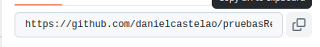
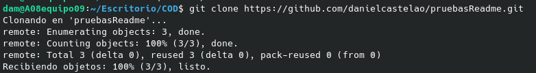

# Metodo 3
1º Accede al repositoirio que quieres clonar  
2º Presiona el boton fork del repositorio que quieras forkear 

  
3º Te pedira que crees un repositorio al que le puedes cambiar al nombre  
4º Una vez creado el repositorio copia el enlace del repositorio desde el boton verde que pone `code`  
   
  
5º Desde la consola ir al directorio en el que  quieres clonar el repositorio  
  
6º Todavia en la consola escribe `git clone` y pega el enlace. Ya estaria todo hecho
 